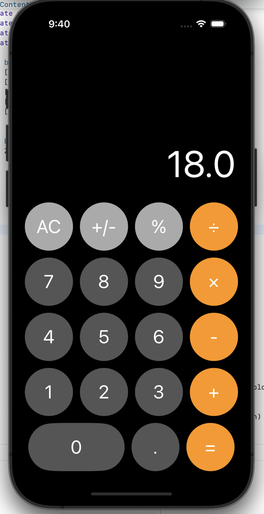

# Swift Calculator App

Welcome to the Swift Calculator App repository! This project is designed to replicate the look and feel of the native iPhone calculator application. It is built entirely in Swift, utilizing modern iOS development practices and ensuring a smooth, responsive user experience.

## Features

- **Standard Mode**: Basic Arithmetic calculations can be performed using this.
- **Intuitive UI**: A sleek, user-friendly interface that mimics the actual iPhone calculator app for familiarity and ease of use.
- **Responsive Design**: Adapts seamlessly to various iPhone screen sizes and orientations.

## Screenshots




## Getting Started

To get started with the Swift Calculator App, follow these steps:

1. **Clone the Repository**
   ```bash
   git clone https://github.com/snnath/CalculatorApp.git
   cd CalculatorApp

2. **Open in Xcode**
   Open the .xcodeproj file in Xcode.

3. **Build and Run**

Select your target device or simulator.
Click the build and run button (or press Cmd + R).

##Requirements
1. Xcode 12.0+
2. IOS 13.0+
3. Swift 5.0+

##Contact
For any inquiries or feedback, feel free to reach out to sn.nath5625@outlook.com

Thank you for checking out the Swift Calculator App! We hope you find it useful and enjoyable to use. Happy calculating!
